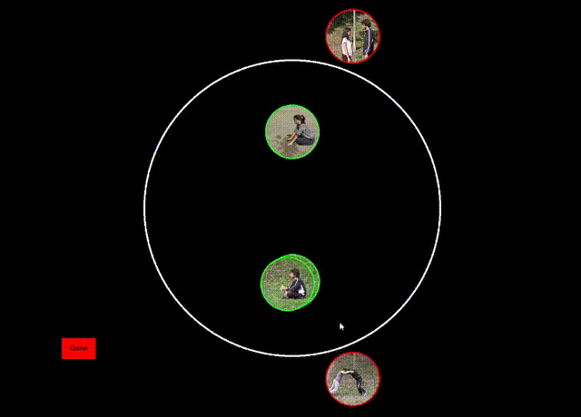

# Multiarrangement - Video, Image, and Audio Similarity Arrangement Toolkit

[](https://www.python.org/downloads/)
[](https://opensource.org/licenses/MIT)

Multiarrangement is an open-source toolkit for collecting human similarity judgments by arranging video, image, or audio stimuli on a 2D canvas. The package supports fixed-batch set-cover experiments and adaptive Lift-the-Weakest (LTW) experiments, then fuses trial-level layouts into representational dissimilarity matrices (RDMs) for downstream analysis.

Distances are computed between stimulus token centers. In the hosted web implementation, submitted center coordinates are interpreted relative to the arena center and scaled by the arena radius before RDM estimation, so equivalent layouts have the same geometry across screen sizes while exact raw coordinates remain available for trial reconstruction.

## Repository layout

- `multiarrangement/` and `coverlib/`: desktop package source, demos, bundled media, and covering-design utilities
- `server/`: FastAPI backend for hosted studies
- `web/`: Next.js frontend for setup, participation, results, and admin flows
- `tests/` and `server/tests/`: regression tests for the package and hosted stack
- `multiarrangement/examples/`: runnable example scripts

## Quick demo



Bundled package assets include:

- videos: `multiarrangement/15videos/*`
- images: `multiarrangement/15images/*`
- audio: `multiarrangement/15audios/*`, `multiarrangement/sample_audio/*`
- instruction clips: `multiarrangement/demovids/*`
- cached covering designs: `multiarrangement/ljcr_cache/*.txt`

## Install

From the repository root:

```bash
python -m pip install .
```

For development and test dependencies:

```bash
python -m pip install -e ".[dev]"
python -m pip install -r server/requirements-dev.txt
```

Requirements:

- Python 3.8 or newer
- NumPy 1.20+
- pandas 1.3+
- pygame 2.0+
- opencv-python 4.5+
- matplotlib 3.4+
- openpyxl 3.0+

## Verify the repository

Package tests:

```bash
pytest tests -q
```

Backend tests:

```bash
pytest server/tests -q
```

Frontend tests and build checks:

```bash
cd web
npm ci
npm run test
npm run build
npm run lint
```

## Local full-stack development

Start the backend:

```bash
cd server
LOCAL_DEV_BYPASS_AUTH=1 uvicorn app.main:app --reload --port 8000
```

In a second terminal, start the frontend:

```bash
cd web
cp .env.example .env.local
npm run dev
```

Set these values in `web/.env.local` for local development:

```bash
NEXT_PUBLIC_API_BASE=http://127.0.0.1:8000
NEXT_PUBLIC_LOCAL_DEV_BYPASS_AUTH=1
```

Optional Supabase media hosting:

```bash
NEXT_PUBLIC_SUPABASE_URL=
NEXT_PUBLIC_SUPABASE_ANON_KEY=
NEXT_PUBLIC_SUPABASE_BUCKET=stimuli
```

Useful routes:

- `/demo` for bundled hosted demos
- `/setup` to create local or hosted studies
- `/participate` to run participant sessions
- `/admin`, `/dashboard`, and `/results` for experimenter workflows

## Python API quickstart

Set-cover demo with bundled media:

```python
import multiarrangement as ma

ma.demo()
```

Adaptive LTW demo with bundled media:

```python
import multiarrangement as ma

ma.demo_adaptive()
```

Minimal set-cover experiment:

```python
import multiarrangement as ma

input_dir = "path/to/input"
output_dir = "path/to/output"

batches = ma.create_batches(ma.auto_detect_stimuli(input_dir), 8)
results = ma.multiarrangement(input_dir, batches, output_dir)
results.vis()
results.savefig(f"{output_dir}/rdm_setcover.png", title="Set-cover RDM")
```

Minimal adaptive LTW experiment:

```python
import multiarrangement as ma

input_dir = "path/to/input"
output_dir = "path/to/output"

results = ma.multiarrangement_adaptive(input_dir, output_dir)
results.vis()
results.savefig(f"{output_dir}/rdm_adaptive.png", title="Adaptive LTW RDM")
```

Example scripts are included under `multiarrangement/examples/`.

## Outputs

Typical outputs include:

- fused RDMs
- per-trial logs
- schedule metadata
- evidence matrices for adaptive runs
- JSON, CSV, XLSX, and NumPy exports, depending on the workflow

## Citation and support

Please cite the software using `CITATION.cff`. Archival metadata for Zenodo is included in `.zenodo.json`.

Source code, releases, documentation updates, and issue tracking are available at:

https://github.com/UYildiz12/Multiarrangement-for-videos

## License

MIT License. See `LICENSE`.
